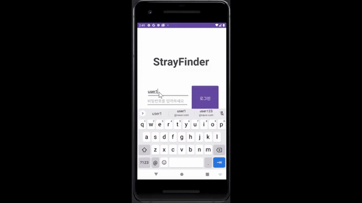

# 🐾 StrayFinder - 유기동물 제보 & 위치 공유 앱

**StrayFinder**는 유기동물을 발견했을 때 위치, 사진, 특징 등을 간편하게 등록하고  
다른 사용자와 공유할 수 있는 **안드로이드 기반 커뮤니티 앱**입니다.  
실종/유기 동물을 빠르게 발견하고 구조할 수 있도록
사용자 간 정보 공유와 제보 기능을 중심으로 설계된 앱입니다.

---

## 📱 앱 시연

---

## 주요 기능

- 유기견 제보 시 위치, 사진, 동물 정보 등록
- 실시간 지도 기반 제보 목록 확인
- 유기동물 상세 정보 확인
- Firebase 연동으로 데이터 실시간 저장
- 네이버 지도 API 기반 주소 검색 및 이동

---

## 사용 기술

| 항목         | 내용                         |
|--------------|------------------------------|
| 언어         | Java                         |
| 플랫폼       | Android                      |
| UI 프레임워크 | Android SDK (XML 기반)       |
| 데이터베이스 | Firebase Firestore           |
| 지도         | Naver Maps SDK               |
| 이미지 처리  | Glide                        |
| 기타         | Android Location, Intent 등  |

---

